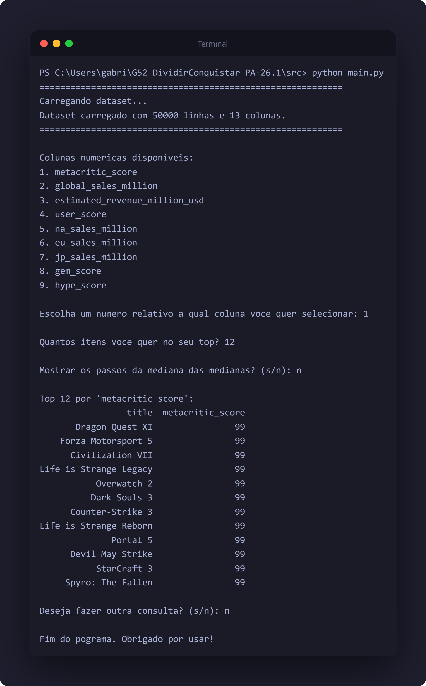

# 

**Número da Lista**: 52<br>
**Conteúdo da Disciplina**: Algoritmos Dividir e Conquistar - Mediana das Medianas<br>

## Alunos  
| Matrícula | Nome |  
|-----------------------|---------------------|  
| 180075462 | [Gabriel Freitas Balbino](https://github.com/gabrielfreitass1) |  

## Descrição do projeto

Esse projeto tem como objetivo mostrar a utilização do Algotitmo de Mediana das Medianas para encontrar o top ranking em um dataset real. A ideia é encontrar o top ranking de alguma coluna disponivel no dataset de Venda de Video Games e Metacrit, diponivel no [Kaggle](https://www.kaggle.com/datasets/meruvakodandasuraj/video-game-sales-and-metacritic-intelligence-198026?resource=download). As colunas que foram analisadas podem ser encontradas da linha 10 ate a 17 em **dataset.py**


## Screenshots Do Trabalho
<br>


## Instalação 
**Linguagem**: Python 3<br>
Foi utilizada a biblioteca pandas que precisa ser instalada
```bash
pip install pandas
```
### Execute a Solução
```
cd src/
python main.py
```                                                                                 

### Link da apresentação
[Vídeo](https://youtu.be/5OPCFPCqmkk)<br>

